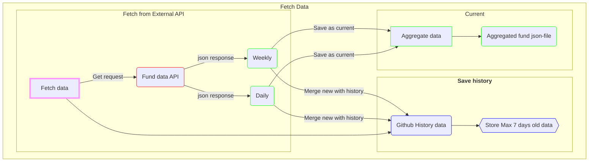

# Bumbisaft

> We all stand on the shoulders of the giants that came before us.

A test project where I combine a few technologies and automation.

## Github Actions

This project uses Github actions. Both scheduled and when this project updates (on push).

## Auto updates (schedule)

The project runs Github actions and updates the files `avanza_data.json` and `Skandia_data_filtered.json`, every Monday to Friday at 18:00.

## Misc

The web pages is to verify that the fetch has runned as scheduled.

## Next thing

Figure out how to "store" history data, to improve the filtered information. A few solutions might be:

-   Store each weeks data to a separate json file.

-   Try to figure out how to get the relevant information from the json-data (the information is there) by analyzing the data.

## Venv

```bash
# Init venv environment
python -m venv venv
```

```bash
# To activate the venv
source venv/Scripts/activate
```

```bash
# To deactivate the environment
deactivate
```

For more information
https://python.land/virtual-environments/virtualenv

## Save pip packages

```bash
pip freeze > requirements.txt
```

## Install pip packages from requirements.txt

```bash
pip install -r requirements.txt
```

## Check installed packages

```bash
pip list
```

For more information
https://www.freecodecamp.org/news/python-requirementstxt-explained/

## Flowdiagram


